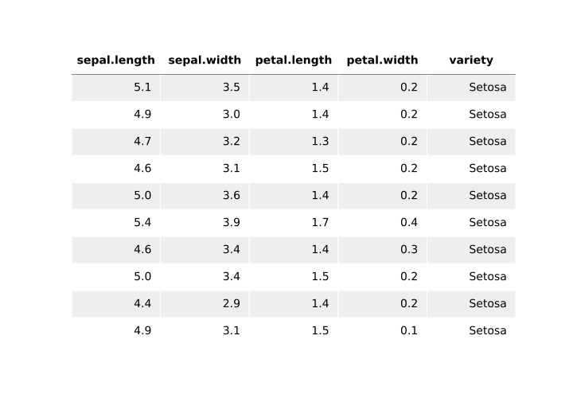
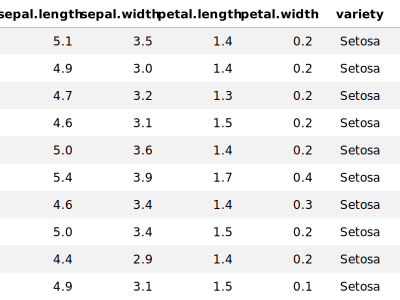

# exporting pandas dataframes to SVG

Pandas will export to `.csv` or `.html`, but these can't always be embedded in a document in a way that renders nicely. Jupyter notebook already renders html tables quite nicely, and it would be great to be able to export this to file.

This code emulates that rendering and outputs to `.svg`, making it infinitely high resolution with small filesize. 

# results

using matplotlib you can get a close approximation (see `./code/write_svg_matplotlib.ipynb`:

the problem here (apart from the annoying vertical white lines) is the text is written in `<path>` objects, so it can't be highlighted and the file is larger than it needs to be. it's really just made up of rectangles, lines, and text so these can be written directly, like so (see `./code/write_svg_directly.ipynb`:

